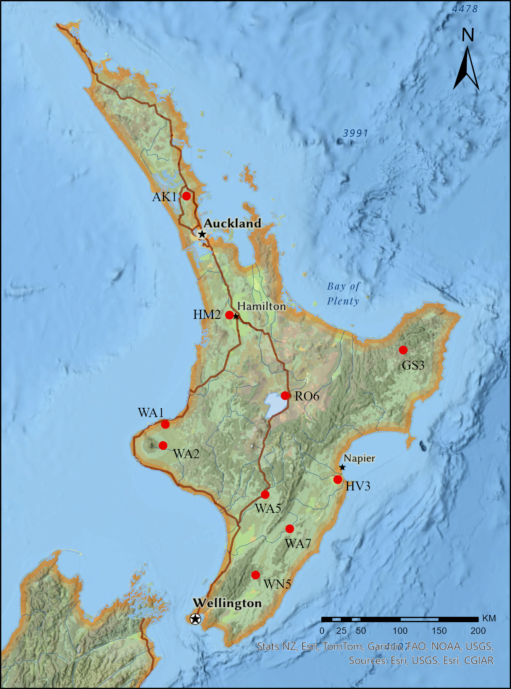

```{r setup, include=FALSE}
knitr::opts_chunk$set(echo = TRUE)
```

## 1. The main content of project

This study focused on 10 water quality monitoring sites in the North Island of New Zealand, systematically analyzing water quality time-series data from 2019 to 2023. It employed a comprehensive approach combining data preprocessing, data validation, time series modeling (ARIMA), non-metric multidimensional scaling analysis (nMDS), and K-means clustering to fully reveal the spatiotemporal variation characteristics and regional heterogeneity of water quality.

Through ARIMA models, nMDS, and K-means clustering, this study systematically analyzed the evolution patterns and spatial distribution differences of regional water quality from both temporal and spatial dimensions. Based on scientific data modeling and clustering analysis, key indicators influencing water quality can be identified, temporal changes in water quality tracked, and spatial heterogeneity among different water bodies explored. This facilitates targeted identification of potential pollution sources in each water body and the implementation of corresponding protective measures.

Additionally, this study established a comprehensive spatio-temporal water quality analysis workflow integrating time series models, clustering analysis, and multidimensional scaling visualization methods, demonstrating strong generalizability and applicability to water quality dynamic analysis in other basins or countries.

The figure below shows the locations of the water sampling sites. The dataset is sourced from [NIWA](https://niwa.co.nz/freshwater/water-quality-monitoring-capabilities) and includes water quality data from 10 sampling sites in the North Island of New Zealand between 2019 and 2023.

This study selected eight key water quality indicators:

-   Water Temperature (Water.Temp, °C)\
-   Turbidity (Turbidity, FNU)\
-   Dissolved Oxygen Saturation (Dis.Oxygen.Sat, %)\
-   pH (pH.25DegC)\
-   Nitrate and Nitrite as Nitrogen (NO3_NO2_N, ppb)\
-   Total Phosphorus (P_Tot, ppb)\
-   Total Coliforms (Tot.Coliforms, MPN/100ml)\
-   Escherichia coli (E.Coli, MPN/100ml)



## 2. Preprocessing data

### 2.1 Loading the essential library

```{r library}
library(tidyverse)
library(dplyr)
library(ggplot2)
library(tidyr)
library(ggrepel)
library(forecast)
library(cluster)
library(factoextra)
library(tseries)
library(vegan)
```

### 2.2 Load and Prepare Water Quality Data

This code reads, cleans, and merges multiple raw CSV files. It standardizes column name formats and adds location identifiers, ultimately saving the organized data to a new file.

```{r data_load}

# Set folder path and get CSV file list
folder_path <- "../raw_data"
file_list <- list.files(path = folder_path, pattern = "\\.csv$", full.names = TRUE)
data_list <- list()
first_file <- TRUE
for(file in file_list) {
  if(first_file){
    # Read first file and get column names and units
    df <- read.csv(file, skip = 3, stringsAsFactors = FALSE)
    col_names <- colnames(df)
    unit <- df[1,2:ncol(df)]
    first_file <- FALSE
  }else{
    # Read other files with same column names
    df <- read.csv(file, skip = 4, stringsAsFactors = FALSE)
    colnames(df) <- col_names
  }
  
  # Convert data columns to character
  df[,2:ncol(df)] <- lapply(df[, 2:ncol(df)], as.character)
  
  # Add location name
  location_name <- tools::file_path_sans_ext(basename(file))
   df$Location <- location_name
  data_list[[length(data_list) + 1]] <- df
}

# Combine all data
combined_data <- bind_rows(data_list)

head(combined_data)

# Export to CSV
write.csv(combined_data, file = "../derive_data/combined.csv", row.names = FALSE)
```

### 2.3 Clean and Organize data

This code further cleans and organizes the merged data: it resets the column names, merges the original variable names with the units, and converts the data values to numeric types, ultimately producing a standardized data table with a clear structure that is easy to analyze.

```{r data_clean}

# Read combined CSV without header
combined_data <- read.csv("../derive_data/combined.csv", header=FALSE, stringsAsFactors=FALSE)

# Extract variable names and units
name <- combined_data[1,2:(ncol(combined_data)-1)]
combined_data[2,2:ncol(combined_data)] <- "Location"
combined_data[2, 1] <- "Date"

# Combine variable name and unit
new_col <- mapply(function(name, unit){
  name_new <- sub("\\.[^.]*$","",name)
  unit_new <- sub("Value", name_new, unit)
  return(unit_new)
}, name,unit)

# Apply new column names
combined_data[2,2:(ncol(combined_data)-1)] <- new_col
new_col <- combined_data[2,]
combined_data <- combined_data[-c(1,2),]

# Convert numeric columns
colnames(combined_data) <- new_col


df[,2:(ncol(df)-1)] <- lapply(df[, 2:(ncol(df)-1)], as.numeric)
head(combined_data)
```

### 2.4 Describe data

This code further cleans and organizes the merged data: it resets the column names, merges the original variable names with the units, and converts the data values to numeric types, ultimately producing a standardized data table with a clear structure that is easy to analyze.

From the line chart, several significant abnormal water quality indicators can be observed, such as:

-   abnormally high concentrations of **E. coli** and **total coliform bacteria** at the WA1 site.
-   abnormally high **turbidity** and **total phosphorus levels** at the WA5 site.
-   abnormally low **dissolved oxygen levels** at the AK1 site. 

Additionally, certain indicators such as **NO₃+NO₂** and water **temperature** exhibit pronounced seasonal fluctuations. 

Based on these findings, further analysis can be conducted in two directions:  
on one hand, to classify water quality and identify key abnormal indicators;  
on the other hand, to test the stationarity and non-white noise characteristics of the time series, providing a foundation for subsequent predictive modeling.

```{R data_description, fig.width=12, fig.height=12}

# Check structure, column names and first rows
str(combined_data)
colnames(combined_data)
head(combined_data)

# Reshape data from wide to long format
data_long <- combined_data %>%
  pivot_longer(cols = -c(Date, Location), names_to = "Variable", values_to = "Value")

# Clean and parse Date column
dates <- gsub("\\s+", " ", data_long$Date)
dates <- trimws(dates) # remove leading/trailing spaces
data_long$Date <- as.POSIXct(data_long$Date, format = "%Y-%m-%d %H:%M:%S", tz = "Pacific/Auckland")

# Save reshaped data
write.csv(data_long, "../derive_data/data_long.csv", row.names = FALSE)

data_long$Value <- as.numeric(data_long$Value)
print(data_long)

# Plot time series trends of variables by location
ggplot(data_long, aes(x = Date, y = Value, color = Location)) +
  geom_line(linewidth = 1) +
  facet_wrap(~ Variable, scales = "free") +
  labs(title = "Trends of various indicators in different regions", x = "Date", y = "Value") +
  theme_bw() +
  theme(legend.position = "bottom")

```

## 3. Classify the water quality across the time

### 3.1 Score each water quality

The main function of this code is to score each record based on specific water quality variable values and analyze the scoring results.

-   It performs scoring function transformations on certain variables, calculates average scores by **month and location**, and visually displays the trends in water quality scores across different regions.
-   It highlights the temporal changes in variables with low scores (1 or 2), making it easier to identify pollution risk points and abnormal indicators.

The following are our scoring criteria for each indicator：

| **Indicator** | **Unit** | **Grade A (4 pts)** | **Grade B (3 pts)** | **Grade C (2 pts)** | **Grade D (1 pt)** |
|------------|------------|------------|------------|------------|------------|
| **Turbidity** | FNU | \<30 | 30–60 | 60–100 | \>100 |
| **Dissolved Oxygen** | \% | \>80 | 60–80 | 40–60 | \<40 |
| **pH** | – | 6.5–8.5 | 6–6.5 or 8.5–9 | 5.5–6 or 9–9.5 | \<5.5 or \>9.5 |
| **NO3 + NO2** | ppb | \<1000 | 1000–3000 | 3000–6000 | \>6000 |
| **Total Phosphorus** | ppb | \<50 | 50–150 | 150–300 | \>300 |
| **Total Coliforms** | MPN/100mL | \<1000 | 1000–3000 | 3000–5000 | \>5000 |
| **E. Coli** | MPN/100mL | \<260 | 260–1000 | 1000–2400 | \>2400 |

We ignored the impact of **water temperature** because, as shown in the line graph above, water temperature remained at normal levels throughout the seasons and did not accurately represent water quality. Therefore, we only scored the other seven indicators.

```{R classify_water_quality}

# Define scoring function based on variable and its value
score_function <- function(var, val) {
  if (var == "Turbidity..Form.Neph. (FNU)") {
    if (val < 30) return(4)
    else if (val < 60) return(3)
    else if (val < 100) return(2)
    else return(1)
  } else if (var == "Dis.Oxygen.Sat (%)") {
    if (val > 80) return(4)
    else if (val > 60) return(3)
    else if (val > 40) return(2)
    else return(1)
  } else if (var == "pH.25DegC (pH)") {
    if (val >= 6.5 & val <= 8.5) return(4)
    else if ((val >= 6 & val < 6.5) | (val > 8.5 & val <= 9)) return(3)
    else if ((val >= 5.5 & val < 6) | (val > 9 & val <= 9.5)) return(2)
    else return(1)
  } else if (var == "NO3.NO2.as.N (ppb)") {
    if (val < 1000) return(4)
    else if (val < 3000) return(3)
    else if (val < 6000) return(2)
    else return(1)
  } else if (var == "P..Tot. (ppb)") {
    if (val < 50) return(4)
    else if (val < 150) return(3)
    else if (val < 300) return(2)
    else return(1)
  } else if (var == "Tot.Coliforms (MPN/100ml)") {
    if (val < 1000) return(4)
    else if (val < 3000) return(3)
    else if (val < 5000) return(2)
    else return(1)
  } else if (var == "E.Coli (MPN/100ml)") {
    if (val < 260) return(4)
    else if (val < 1000) return(3)
    else if (val < 2400) return(2)
    else return(1)
  } else {
    return(NA)
  }
}

# Apply scoring to filtered data (exclude missing and temperature)
score_data <- data_long %>% 
  filter(!is.na(Value) & Variable != "Water.Temp (°C)")%>%
  rowwise() %>%
  mutate(Score = score_function(Variable, Value)) %>%
  ungroup()
print(score_data)

# Calculate average monthly score by Location
monthly_scores <- score_data %>%
  mutate(YearMonth = floor_date(Date, "month")) %>%
  group_by(Location, YearMonth) %>%
  summarise(Average_Score = mean(Score, na.rm = TRUE), .groups = "drop")

```

### 3.2 visualize water quality score results

This code is primarily used for visualizing and analyzing water quality score results. First, monthly average water quality score trend charts were plotted for each monitoring site to identify overall water quality changes. Subsequently, low-score data with scores of 1 or 2 were filtered, and trend charts for abnormal indicators were plotted separately for **coliform bacteria** and other indicators (such as **pH, total phosphorus, and turbidity**) to further reveal key water quality issues in different regions. Finally, low-score **pH** data were extracted for further analysis.

1.  The results showed that RO6 and WN5 were the areas with the best water quality, with no indicators scoring below B.

-   RO6 is located near Taopu Lake, where water quality is well managed.
-   WN5 is located in the southernmost mountainous area of the North Island, surrounded by no urban development and only crossed by a highway, where water quality is well protected.

2. Other characteristics include: HV3 performed excellently in terms of **total coliform bacteria** and **Escherichia coli**; GS3 performed excellently in terms of **total phosphorus** and **turbidity**.

3.  In areas with poor water quality, AK1, WA5, and WA1 experienced multiple instances of abnormal **E. coli and total coliform counts**. Similarly, these three locations performed poorly in terms of **total phosphorus and turbidity**. They are located in Hoteo at Gubbs, Waitara at Bertrand Rd, and Rangitikei at Mangaweka, respectively. Further analysis of land use types in these three locations is needed to better explain the causes.

```{R plot_abnormal_index, fig.width=12, fig.height=8}

# Plot monthly average water quality score by location
ggplot(monthly_scores, aes(x = YearMonth, y = Average_Score)) +
  geom_line(linewidth = 1, color = "blue") +
  labs(title = "Monthly Average Water Quality Score by Location",
       x = "Month", y = "Average Score") +
  facet_wrap(~Location, scales = "free") +
  theme_bw() +
  theme(legend.position = "bottom")

# Filter low scores (1 or 2)
low_scores <- score_data %>%
  mutate(YearMonth = floor_date(Date, "month")) %>%
  filter(Score %in% c(1, 2)) 

# Plot low-score trends for E.Coli and Tot.Coliforms
ggplot(low_scores %>% filter(Variable %in% c("E.Coli (MPN/100ml)", "Tot.Coliforms (MPN/100ml)")), aes(x = Date, y = Value, color = Variable)) +
  geom_line(size = 1) +
  geom_text(aes(label = round(Value, 1)),
            size = 2.5,
            vjust = -0.5,
            check_overlap = TRUE) +
  labs(title = "Monthly low Water Quality Score by Location for Coliforms",
       x = "Month", y = "low Score") +
  facet_wrap(~Location, scales = "free_y") +
  theme_bw() +
  theme(legend.position = "bottom")

# Plot low-score trends for other variables excluding coliforms
ggplot(low_scores %>% filter(!Variable %in% c("E.Coli (MPN/100ml)", "Tot.Coliforms (MPN/100ml)")), aes(x = Date, y = Value, color = Variable)) +
  geom_line(linewidth = 1) +
  geom_text(aes(label = round(Value, 1)),
            size = 2.5,
            vjust = -0.5,
            check_overlap = TRUE) +
  labs(title = "Monthly low Water Quality Score by Location for PH, P.Tot. (ppb), Turbidity",
       x = "Month", y = "low Score") +
  facet_wrap(~Location, scales = "free_y") +
  theme_bw() +
  theme(legend.position = "bottom")


# Filter specific low score subsets for inspection
low_ph_scores <- low_scores %>% filter(Variable == "pH.25DegC (pH)")
low_Coli_HV3 <- low_scores %>% filter(Variable %in% c("E.Coli (MPN/100ml)", "Tot.Coliforms (MPN/100ml)") & Location =="HV3")

print(low_ph_scores)
print(low_Coli_HV3)
print(low_scores)

```

## 4. Analyse water quality - Time-series data

### 4.1 Analyse water quality - Non_stationary test

The main purpose of this code is to test the stationarity of time series data corresponding to each monitoring point (Location) and water quality indicator (Variable). The specific process includes:

1.  aggregating the data by month and taking the average;
2.  using linear interpolation to fill in missing values and constructing a time series object;
3.  using the ADF (Augmented Dickey-Fuller) test to determine whether the time series is stationary, and outputting the p-value and the determination result for each set of data.

```{R stationary_test,  fig.width=12, fig.height=12}


# Split data_long by Location and Variable into a list 
data_list <- data_long %>%
  group_by(Location, Variable) %>%
  group_split()

results <- list()


# Create full YearMonth sequence to ensure continuous monthly data
full_dates <- data.frame(YearMonth = seq.Date(from = as.Date("2019-01-01"),
                                         to = as.Date("2023-12-01"),
                                         by = "month"))

# For each group, aggregate monthly means, fill missing months by interpolation, then run ADF test
results <- map(data_list, function(df) {
  df <- df %>% arrange(Date)
  df <- df %>% 
  mutate(YearMonth = floor_date(as.Date(Date), unit = "month")) %>%
  group_by(YearMonth) %>% 
  summarise(Value = mean(as.numeric(Value), na.rm = TRUE),.groups = "drop") 
  
  # Left join to get full monthly timeline, with NAs for missing months
  df_full <- full_dates %>% 
    left_join(df, by = "YearMonth") %>% 
    arrange(YearMonth)
  
  # Linear interpolation for missing values
  df_full$Value <- zoo::na.approx(df_full$Value, na.rm = FALSE)
  values <- as.numeric(df_full$Value)
  
  # Convert to time series object 
  ts_obj <- ts(values, start = c(2019, 1), frequency = 12)
  res <- suppressWarnings(adf.test(ts_obj))
  
  return(res)
})

# Summarize test results into a table with p-values and stationarity flag
summary_table <- map_dfr(seq_along(results), function(i) {
  test_result <- results[[i]]
  tibble(
    ID = i,
    p_value = test_result$p.value,
    stationary = ifelse(test_result$p.value < 0.05, TRUE, FALSE)
  )
})
print(summary_table)
```

The main purpose of this code is to filter out time series data that has passed the ADF test for stationarity. Specifically, based on the previously generated test results table, it extracts the indices corresponding to all sequences determined to be stationary (stationary == TRUE) and extracts these sequences from the original data list and saves them to the stationary_data list. The reason for not performing forced differencing is that it is easy to eliminate the trend component of the data. Extract stationary data for subsequent white noise testing.

```{R stationary_data}

# Extract IDs of stationary time series from summary table
stationary_ids <- summary_table %>%
  filter(stationary == TRUE) %>%
  pull(ID)

# Collect corresponding data frames from data_list
stationary_data <- list()
for (j in seq_along(stationary_ids)) {
  i <- stationary_ids[j]  # Get the position of non-stationary sequences in data_list
  stationary_data[[j]] <- data_list[[i]]  
  
}

# Combine all stationary time series into one data frame
stationary_df <- bind_rows(stationary_data) 
  
head(stationary_df)
```

### 4.2 Analyse water quality - white noise test

The primary function of this code is to further analyze whether the previously screened stationary time series are white noise. The specific process includes:

-   Aggregating monthly data for each stable monitoring point and indicator;
-   Using the Box test **(Ljung-Box)** to test whether the time series is white noise;
-   Recording the test results (p-value, statistics) for each group, along with the corresponding monitoring points and variable information;
-   Finally, summarizing the results into a data frame, screening out sequences that are significantly not white noise, and listing the corresponding locations and indicators.

```{R white_noise_test}

# Apply white noise test (Ljung-Box) to each stationary time series
white_noise_results <- map(stationary_data, function(df) {
  
  df <- df %>% arrange(Date)
  Locations <- df$Location
  Var <- df$Variable
  
  # Aggregate to monthly mean values
  df <- df %>% 
  mutate(YearMonth = floor_date(as.Date(Date), unit = "month")) %>%
  group_by(YearMonth) %>% 
  summarise(Value = mean(as.numeric(Value), na.rm = TRUE),.groups = "drop") 
  
  # Fill missing months and interpolate missing values
  df_full <- full_dates %>% 
    left_join(df, by = "YearMonth") %>% 
    arrange(YearMonth)
  df_full$Value <- zoo::na.approx(df_full$Value, na.rm = FALSE)
  values <- as.numeric(df_full$Value)
  
  # Create time series object and run Ljung-Box test
  ts_obj <- ts(df_full$Value, start = c(2019, 1), frequency = 12)
  test_res <- Box.test(ts_obj, lag = 12, type = "Ljung-Box")
   
  # Return test result with metadata
  list(
    Location = unique(Locations),
    Variable = unique(Var),
    value = df_full$Value,
    date = df_full$YearMonth,
    p_value = test_res$p.value,
    statistic = test_res$statistic,
    white_noise = ifelse(test_res$p.value < 0.05, TRUE, FALSE)
  )
})

# Convert results to data frame for summary
white_noise_summary <- bind_rows(white_noise_results)
print(white_noise_summary)

# List variables considered white noise and their associated locations
white_noise_vdata <- white_noise_summary %>%
  filter(white_noise) %>%
  select(Location, Variable) %>%
  group_by(Variable) %>%
  summarise(locations = paste(unique(Location), collapse = ", "))

print(white_noise_vdata)
```

### 4.3 Analyse water quality - ARIMA model

Based on the above verification, it was found that water temperature and NO3.NO2 indicators are stable and non-white noise sequences in most regions, so an appropriate model can be selected for model training and prediction.

We selected the water temperature time series from the HV3 location for modeling and prediction, with similar analysis processes applied to other time series.

1.  Extracted the water temperature data from this location and constructed a monthly time series.
2.  Used the auto.arima() function to automatically select the optimal ARIMA model for fitting, plotted the fitting results, and generated a forecast for the next 12 months' water temperatures.
3.  Output the prediction results.

The model results show that the ARIMA model reasonably captures the seasonal and non-seasonal changes in water temperature data. The parameter estimates are stable and significant, and the error indicators (such as RMSE, MAE, and MAPE) indicate that the model fits well. The residuals show no obvious autocorrelation, indicating that the model has good and reliable predictive performance.

The plotted fitting results are consistent with the original data trend.

```{R model}

# Extract data for Water Temperature at location HV3
model_data <- white_noise_summary %>% select(date, Location, Variable, value)

# Convert to time series object (monthly frequency)
watertmp_HV3_data <- model_data %>% filter(Variable == "Water.Temp (°C)" & Location == "HV3")

# Fit ARIMA model
watertmp_HV3_ts <- ts(watertmp_HV3_data$value, start = c(2019, 1), frequency = 12)

model <- auto.arima(watertmp_HV3_ts)

# Show model summary
summary(model)

# Plot observed vs fitted values
autoplot(watertmp_HV3_ts) +
  autolayer(fitted(model), series = "Fitted") +
  ggtitle("Observed vs Fitted values") +
  ylab("Water Temperature") +
  xlab("Time")

# Forecast next 12 months
future <- forecast(model, h = 12)  

# Plot forecast
autoplot(future) +
  ggtitle("Forecast of Water Temperature") +
  xlab("Time") + ylab("Temperature")

print(future)
```

## 5. Spatial Water Analyse for each year - nMDS and K_means clustering

### 5.1 Spatial Water Analyse for each year - nMDS

The primary function of this code is to perform non-metric multidimensional scaling (nMDS) on water quality indicators for each region from 2019 to 2023, in order to visualize the similarities or differences in overall water quality characteristics among regions over the five-year period.

The code first calculates the annual average values of each water quality indicator for each region by year, constructs a Bray-Curtis distance matrix, and performs a two-dimensional nMDS dimensionality reduction analysis. It then outputs the corresponding coordinate results for each year and uses ggplot2 to plot the distribution patterns of each region in the nMDS space for each year, making it easier to identify trends in water quality characteristics over time and clustering structures between regions.

1.  In 2019，the results of the nMDS analysis show that the similarity of water quality across locations was relatively concentrated, indicating that water quality indicators were consistent across regions.
2.  In 2020, samples exhibited significant dispersion along the second dimension of the nMDS, reflecting the emergence of regional differences in water quality characteristics.
3.  In 2021, the 10 monitoring sites had clustered into three distinct categories, with high intra-category similarity, suggesting that water quality conditions were relatively consistent within each category.
4.  In 2022, the pattern of water quality similarity underwent significant changes, with the HV3 and WA1 sites beginning to show noticeable dispersion, resulting in five distinct categories, indicating an increase in water quality differences.
5.  In 2023, similarity between samples further decreased, primarily manifested in the dispersion along the first dimension of the nMDS, indicating a significant enhancement in the spatial diversity and heterogeneity of water quality conditions.

```{R nMDS, fig.width=12, fig.height=8}
data_long_nmds <- data_long %>%
  mutate(Year = format(as.Date(Date), "%Y"))

years <- 2019:2023
nmds_results <- list()

for (yr in years) {
  # Filter the data of the current year
  year_data <- data_long_nmds %>% filter(Year == as.character(yr))
  
  # Construct a wide table of "region × indicator" : Calculate the average value for each indicator in each region
  mat <- year_data %>%
    group_by(Location, Variable) %>%
    summarise(mean_value = mean(Value, na.rm = TRUE), .groups = "drop") %>%
    pivot_wider(names_from = Variable, values_from = mean_value)
  
  # Remove the "Location" column to obtain a pure numerical matrix
  dist_mat <- mat %>% select(-Location) %>% 
    as.data.frame() %>%
    mutate(across(everything(), as.numeric))
  
  # Set the trade name as the region
  rownames(dist_mat) <- mat$Location
  
  # Calculate the distance matrix (Bray-Curtis)
  bray_dist <- vegdist(dist_mat, method = "bray")
  
  # operation nMDS (k=2 dimension)
  suppressWarnings({
    invisible(capture.output({
      nmds <- metaMDS(bray_dist, k = 2, trymax = 50)
    }))
  })
  
  # Extract nMDS coordinates and convert them to a data frame.
  nmds_points <- as.data.frame(nmds$points)
  nmds_points$Location <- rownames(nmds_points)
  nmds_points$Year <- yr
  
  nmds_results[[as.character(yr)]] <- nmds_points
}

nmds_all <- bind_rows(nmds_results)
head(nmds_all)

# Draw a graph: x and y are nMDS coordinates. 
ggplot(nmds_all, aes(x = MDS1, y = MDS2, color = Location)) +
  geom_point(size = 3) +
  facet_wrap(~ Year) +
  theme_bw() +
  labs(title = "nMDS analysis of water quality indicators in different regions of each year", x = "nMDS1", y = "nMDS2")

```

### 5.2 Spatial Water Analyse for each year - K-means clustering

#### 5.2.1 Find the optimal number of clusters k

The code segment first groups the data_long data by year and constructs a wide-format matrix of region × indicator for each year to analyze the characteristic differences between different regions in multiple water quality indicators. Subsequently, these numerical data are standardized, and the Silhouette method is used to evaluate the clustering effectiveness under different numbers of clusters. The optimal number of clusters k for each year is visualized using fviz_nbclust, providing a basis for subsequent K-means clustering.

Based on the evaluation results of the Silhouette method, we selected the highest-scoring number of clusters each year as the initial optimal k value. The optimal k values for each year are as follows: 2 for 2019, 3 for 2020, 2 for 2021, 4 for 2022, and 2 for 2023.

However, it is important to note that in 2019 and 2020, the difference between the highest Silhouette score and the second-highest score (when k=3 or k=2) is relatively small, indicating that there are multiple similar clustering structures in these two years. Therefore, in the subsequent K-means clustering analysis, we will simultaneously test both k values to ensure the robustness and interpretability of the clustering results.

```{R cluster1}

# Add a 'Year' column to the long-format data
data_long_cluster <- data_long %>%
  mutate(Year = format(as.Date(Date), "%Y"))

years <- 2019:2023
cluster_results <- list()

for (yr in years) {
  # Filter data for the specific year
  year_data <- data_long_cluster %>% filter(Year == as.character(yr))
  
  # Create wide-format table: average value for each Variable per Location
  mat <- year_data %>%
    group_by(Location, Variable) %>%
    summarise(mean_value = mean(Value, na.rm = TRUE), .groups = "drop") %>%
    pivot_wider(names_from = Variable, values_from = mean_value)
  
  # Remove Location column and convert to numeric matrix
  dist_mat <- mat %>% select(-Location) %>% 
    as.data.frame() %>%
    mutate(across(everything(), as.numeric))
  
  # Set row names as Location
  rownames(dist_mat) <- mat$Location
  
  # Standardize the data
  scaled_data <- scale(dist_mat)
  
  # Determine optimal number of clusters using silhouette method
  print(fviz_nbclust(scaled_data, kmeans, method = "silhouette", k.max = 9) +  # 假设你目测选择 k=3
  labs(title = paste("Silhouette Method for Optimal k - ", yr)))
  
  # Store the scaled data
  cluster_results[[as.character(yr)]] <- scaled_data
}

```

#### 5.2.2 Perform K-means clustering analysis

Therefore, we ultimately selected the clustering numbers k=[4,3,2,4,2] to perform K-means clustering analysis on the data from 2019 to 2023. The results show that this configuration can clearly classify the water quality characteristics of the 10 monitoring sites.

From the clustering results, it can be observed that although the clustering structure changed over the five years, some locations remained in the same cluster, exhibiting relatively consistent water quality characteristics.

-   AK1 and HM2, HV3 and WA7, and RO6 and WN5 were in the same cluster for most of the five years, indicating a high degree of similarity in their water quality characteristics. It should be noted that although RO6 and WN5 were not classified into the same cluster in 2019, their spatial locations are adjacent, and their clustering distances are also relatively close, further supporting the similarity in water quality conditions between the two locations.

- WA1 exhibits distinct water quality characteristics compared to other regions in most years, particularly between 2021 and 2022, and is often classified separately, indicating its sustained and unique water quality status. In contrast, WA5 exhibits strong temporal variability, with its cluster affiliation changing multiple times over the five-year period. It has been classified into both poorer water quality categories and superior water quality clusters, reflecting significant fluctuations and changes in the water body's environmental conditions during the study period.

- Finally, GS3 and WA2 belong to the same category in all years except 2020, indicating that their water quality conditions are also similar.

```{R cluster2}

# Set optimal k for each year manually
kvalue <- c(4, 3, 2, 4, 2)
names(kvalue) <- as.character(2019:2023) 
km_results <- list()

for (yr in years) {
  set.seed(123)  # Set seed for reproducibility
  
  scaled_data <- cluster_results[[as.character(yr)]]

  k_optimal <- kvalue[[as.character(yr)]]  # Get predefined k for the year
  
  # Perform K-means clustering
  km_res <- kmeans(scaled_data, centers = k_optimal, nstart = 25)
  km_results[[as.character(yr)]] <- km_res
  
  # Ensure rownames are correctly assigned
  rownames(scaled_data) <- unique(data_long$Location)
  
  # Visualize clustering result
  graph <- fviz_cluster(km_res, data = scaled_data,
             geom = "point", ellipse.type = "convex", 
             main = paste("K-means cluster result -", yr))
  graph <- graph + geom_text_repel(aes(label = rownames(scaled_data))) +
    theme_bw()
  print(graph)
}
```

## 6. Conclusion

This study systematically analyzed water quality data from 10 monitoring sites in the North Island of New Zealand between 2019 and 2023. By combining data cleaning, anomaly detection, time series modeling, nMDS dimensionality reduction, and K-means clustering, the study revealed both temporal changes and spatial differences in water quality across regions.

First, through visualization and analysis of monthly average water quality scores, several key abnormal indicators were identified. For example, E. coli and total coliform concentrations were abnormally high at the WA1 site; turbidity and total phosphorus were high at the WA5 site; and dissolved oxygen was unusually low at the AK1 site. These findings suggest potential pollution problems in these regions. In addition, NO₃+NO₂ and water temperature showed clear seasonal variation, which is useful for future predictive modeling.

Additionally, based on further analysis of low scores (1 or 2), it was found that RO6 and WN5 had overall good water quality, with no indicators scoring below grade B. HV3 showed good performance for coliform indicators, and GS3 had good results for phosphorus and turbidity. In contrast, AK1, WA1, and WA5 showed multiple indicators with poor results and frequent pollution, suggesting the need to investigate local land use types to understand the causes.

The nMDS results revealed changing patterns of water quality similarity across years. In 2019, sites were closely grouped, indicating high similarity. In 2020, samples became more spread out along the second dimension, suggesting regional differences. In 2021, three clusters formed with high similarity within groups. In 2022, sites like HV3 and WA1 became more distinct, forming five clusters. By 2023, differences increased further, mainly along the first dimension, showing more spatial diversity in water quality.

In the K-means clustering analysis, we chose k = [4, 3, 2, 4, 2] as the best number of clusters for each year. The results showed clear classification of the 10 sites based on their water quality characteristics. Although clustering patterns changed over time, some sites remained in the same cluster over the years. For example, AK1 and HM2, HV3 and WA7, and RO6 and WN5 were often grouped together, showing stable and similar water quality. WA1 often formed its own cluster, especially in 2021–2022, indicating a unique water quality pattern. In contrast, WA5 changed cluster frequently, reflecting large changes in environmental conditions. GS3 and WA2 were in the same cluster in all years except 2020, suggesting similar water quality in most years.

In addition, I conducted stationarity tests and white noise tests on the time series data of each variable in each region, then selected one of the stationary and non-white noise variable data sets for ARIMA model training and prediction, achieving excellent fitting results.
